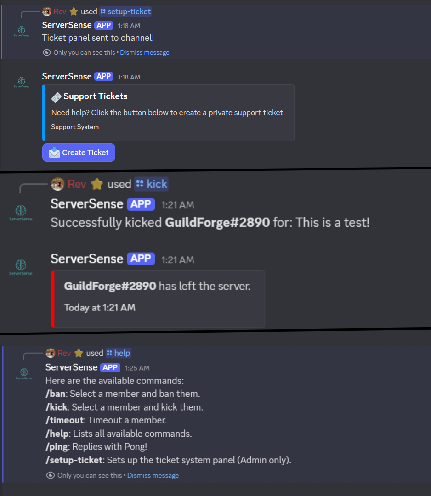

# Aegis Bot



A comprehensive Discord bot focused on moderation and security.

## Features

- **Moderation**: Key commands (Kick, Ban, Timeout) are protected by specialized role guards.
- **Log System**: Detailed embed logs for all moderation actions.
- **Tickets**: Private support channels with a one-click setup.
- **Auto-Mod**: Built-in filters for bad words and spam.
- **Welcome**: Customizable welcome/goodbye messages.

## Setup

1. **Install dependencies**
   ```bash
   npm install
   ```

2. **Configuration**
   - Create a `.env` file with your credentials:
     ```
     DISCORD_TOKEN=your_token
     CLIENT_ID=your_id
     GUILD_ID=your_id
     ```
   - Update `config.json` with your specific Role and Channel IDs.

3. **Deploy Commands**
   ```bash
   npm run deploy
   ```

4. **Start**
   ```bash
   npm start
   ```

## Customization

You can adjust spam thresholds and filtered words directly in `config.json`.
